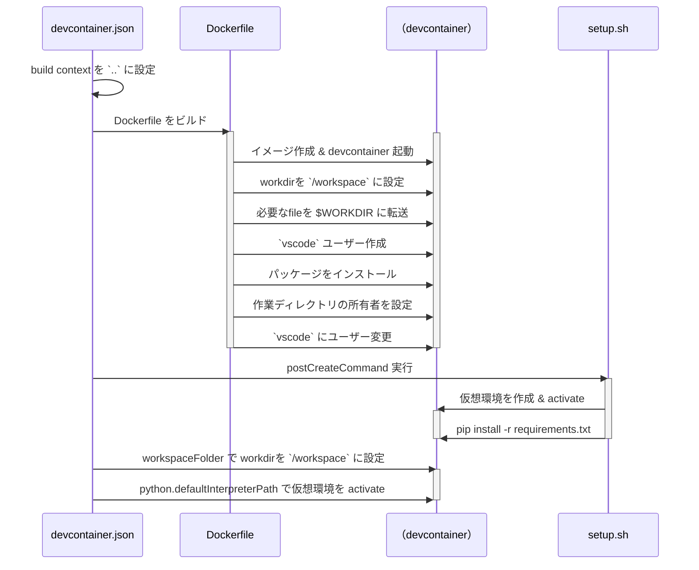

# docker_world
## 処理の流れ
以下は、`devcontainer.json` を基点に Docker コンテナを利用して Python 開発環境をセットアップするプロセスを示しています。
### 1. **`devcontainer.json` の読み込み**
- Visual Studio Code の Dev Container 定義ファイル。
- 定義された設定に基づき、コンテナのビルド・起動、およびセットアップを行います。

### 2. **Dockerfile のビルド**
- `devcontainer.json` の `"build"` セクションに従い、`Dockerfile` を使用して Docker イメージをビルドします。
- 必要なスクリプト（例: `setup.sh` など）がビルド時にコンテナ内にコピーされます。

### 3. **Docker コンテナの起動**
- ビルドした Docker イメージからコンテナを作成します。
- この段階で必要な環境変数設定（例: `containerEnv`）、作業ディレクトリ設定（例: `workspaceFolder`）が反映されます。

### 4. **作業ディレクトリの設定**
- コンテナ内の作業ディレクトリを `/workspace` に設定します。
- これは `devcontainer.json` の `"workspaceFolder": "/workspace"` によって制御されています。

### 5. **`setup.sh` の実行**
- `devcontainer.json` の `"postCreateCommand"` オプションを使用して、起動されたコンテナ内で `setup.sh` を実行します。
- スクリプト内で行われる主な処理:
    - 仮想環境 (`.venv`) の作成とシェル内での一時的な有効化。
    - `requirements.txt` に記載された Python パッケージのインストール。

### 6. **仮想環境の再度有効化**
- 仮想環境は `setup.sh` 実行時に一時的に有効化されますが、シェルセッション終了後は無効になります。
- そのため、`devcontainer.json` の以下の設定により、VS Code 内で仮想環境を再度有効化します:

```
  "python.defaultInterpreterPath": "/workspace/.venv/bin/python"
```
- 開発環境において、この設定により `.venv` が自動的に Python インタープリタとして認識され、デフォルトで使用可能になります。

### 7. **VS Code のカスタマイズ設定の適用**
- 以下の拡張機能とエディタ設定が自動的に適用されます:
    - **フォーマッタ**: `ms-python.black-formatter`
    - **静的解析ツール**: `ms-python.flake8`
    - **API テストツール**: `humao.rest-client`

- 開発効率を高めるために、以下の VS Code 設定も反映されます:
    - **コード整形**: `"editor.formatOnSave": true, "editor.formatOnPaste": true`

## シーケンス図
以下に、上記プロセスをマーメイド記法でシーケンス図として示します。


## 設定の重要ポイント
1. **仮想環境のセットアップ**:
    - `devcontainer.json` の `"postCreateCommand": "/workspace/setup.sh"` により仮想環境が作成され、必要な Python パッケージがインストールされます。

2. **仮想環境の自動有効化**:
    - `"python.defaultInterpreterPath": "/workspace/.venv/bin/python"` によって、仮想環境がデフォルトの Python インタープリタとして設定されます。

3. **カスタマイズ設定**:
    - `devcontainer.json` に定義された拡張機能やエディタ設定を利用することで、開発作業を即座に始められる環境が用意されます。
