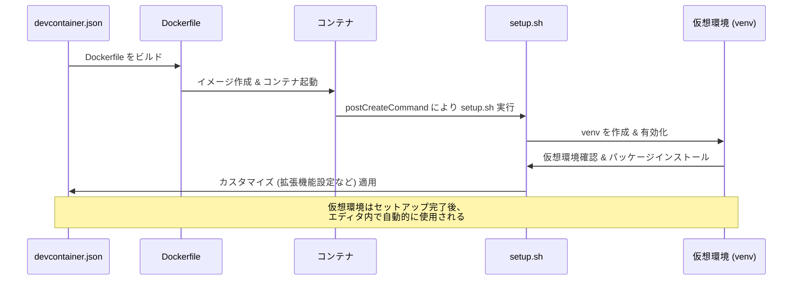

# docker_world

### 処理の流れ
1. **`devcontainer.json` の読み込み**:
    - Visual Studio Code の Dev Container 定義ファイルであり、記載された設定に基づき Docker コンテナを準備。

2. **Dockerfile のビルド**:
    - `devcontainer.json` の `"build": { "dockerfile": "./Dockerfile" }` に指定された Dockerfile を基にイメージをビルド。
    - ファイル・ディレクトリ（例: `setup.sh`, `requirements.txt`）をコンテナにコピー。

3. **Docker コンテナの起動**:
    - ビルドしたイメージからコンテナを起動し、devcontainer.json に指定された環境変数やカレントディレクトリ設定を反映。

4. **仮想環境のセットアップ (`setup.sh`)**:
    - `postCreateCommand` により `setup.sh` を実行:
        - 仮想環境 (`.venv`) が存在しない場合は新規作成。
        - 仮想環境を作成した後は、その仮想環境を有効化。
        - 必要に応じて `requirements.txt` に記載された Python パッケージをインストール。

5. **セットアップ後に仮想環境を有効にする**:
    - セットアップが正常に完了すると、以下の設定が自動的に適用される:
        - `python.defaultInterpreterPath` に `.venv/bin/python` （仮想環境の Python インタプリタ）を設定。
        - 開発時、エディタで仮想環境が優先される。

6. **カスタマイズの適用**:
    - `.devcontainer.json` の `"customizations"` に記載された拡張機能や設定（例: フォーマッタ、静的解析ツールの拡張機能）を適用。

### セットアップの重要ポイント
- **仮想環境 (venv) の有効化**:
    - セットアッププロセス中、`.venv` が作成され、`setup.sh` 内で自動的に有効化されます。
    - `.venv` の有効化はシェルセッション内のみ有効なため、追加の環境で使用する場合は以下のコマンドを実行してください:

```shell
    source /workspace/.venv/bin/activate
```

- **Visual Studio Code の設定への反映**:
    - 作成した仮想環境は自動的にワークスペースの Python インタープリタとして適用され、VS Code の設定により使用できます。

### マーメイド記法によるシーケンス図
以下の図は、コンテナ準備から仮想環境有効化までの流れを視覚化しています。



### 注意事項
- **仮想環境の再利用**:
    - セットアップ後に仮想環境を有効にする際、毎回手動で仮想環境を有効化する必要がある場合があります。

```shell
    source /workspace/.venv/bin/activate
```

- `.devcontainer.json` 設定により、インタープリタの設定が有効化されるため、通常の作業ではこの手順は不要です。
- **CLI からの操作**:
    - 仮想環境に依存した CLI コマンドを実行する場合も、source コマンドで仮想環境を有効化してください。
