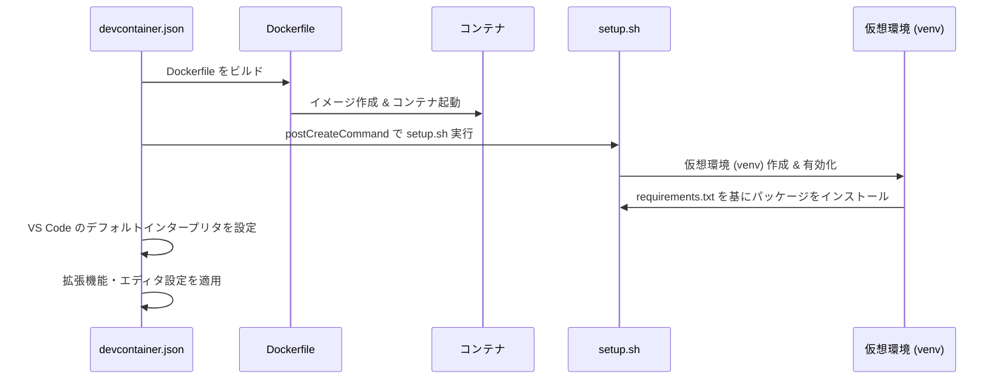

# docker_world

### 処理の流れ
1. **`devcontainer.json` の読み込み**:
    - Visual Studio Code の Dev Container 定義ファイル。
    - 定義された設定に基づいて、コンテナのビルド・起動・セットアップが行われます。

2. **Dockerfile のビルド**:
    - `devcontainer.json` の `"build"` セクションに従い、Dockerfile を使用して Docker イメージをビルド。
    - 必要なファイル（`setup.sh` など）がコンテナにコピーされます。

3. **Docker コンテナの起動**:
    - ビルドしたイメージからコンテナを作成し、必要な設定（環境変数や作業ディレクトリなど）を反映した後に起動。

4. **`setup.sh` の実行**:
    - `devcontainer.json` の `"postCreateCommand"` によって、コンテナ内で `/workspace/setup.sh` が実行されます。
    - 主な処理:
        - 仮想環境 (`.venv`) の作成と有効化。
        - `requirements.txt` に記載された Python パッケージのインストール。

5. **VS Code で仮想環境が自動的に有効化**:
    - `devcontainer.json` の `"python.defaultInterpreterPath": "/workspace/.venv/bin/python"` に基づき、仮想環境がデフォルトのインタープリタとして設定されます。
    - 開発環境が即使用可能な状態になります。

6. **VS Code のカスタマイズ設定の適用**:
    - エディタ設定や拡張機能が適用され、より快適な開発環境が整います。

### マーメイド記法によるシーケンス図
以下に、`devcontainer.json` を中心とした具体的な処理フローを示します。

### 設定の重要ポイント
1. **仮想環境のセットアップ**:
    - `devcontainer.json` の `"postCreateCommand": "/workspace/setup.sh"` によって、セットアップスクリプトが実行されます。
    - 仮想環境が自動的に作成・有効化され、Python パッケージがインストールされます。

2. **仮想環境の自動有効化**:
    - `"python.defaultInterpreterPath": "/workspace/.venv/bin/python"` によって、セットアップ後の仮想環境が VS Code 内で自動的に有効となります。

3. **カスタマイズ設定**:
    - 拡張機能（例: `ms-python.black-formatter`）やエディタ設定が反映されるため、追加設定不要で開発をすぐに開始できます。
